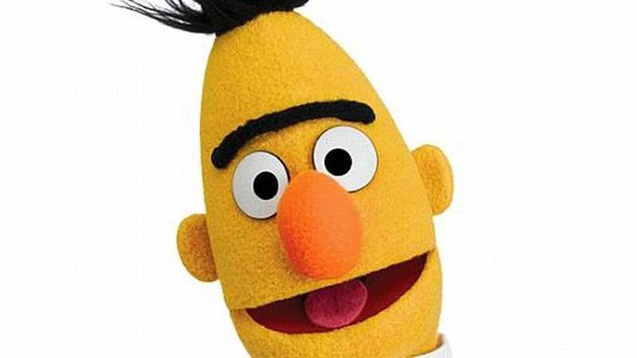
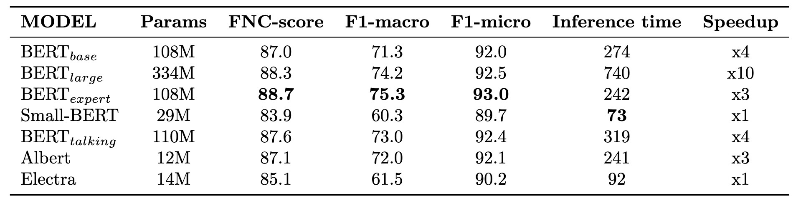
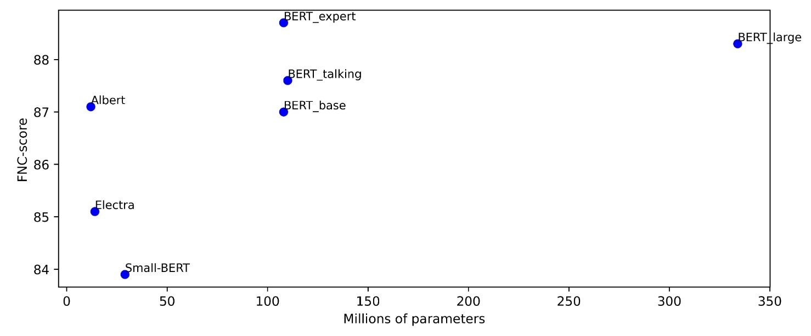

# BERT-family models in a Fake News Detection task
Transformer based models have led to a revolution in NLP, as they
can reach SOTA in a wide variety of tasks, and for this reason many
people associate their introduction into NLP with “ImageNet moment”
in Computer Vision. In this project I try to test many different kinds
of Transformer encoder architecture, which belongs to the BERT family, considering both transfer learning techniques through fine tuning of
pre-trained model and feature extraction to obtain contextual word embedding. All my trials were done to solve the FNC-1 challenge and led
me to improve the SOTA results reported in the challenge website.

The full documentation can be found [here](Report.pdf).

## FNC-1 task
I have trief to solve the Fake News Challenge (FNC-1), a proposed countermeasure to combat the spread of false information, which is a major concern in the news industry. The challenge is divided into simpler steps, with the first being Stance Detection - understanding the position a news article takes on a particular topic. The model I will be submitting will determine the relationship between the text of the article and its headline, determining if the text agrees, disagrees, discusses, or is not related to the headline.

## Methods
I experimented with different pre-trained models from the BERT family, i.e as BERTbase, BERTlarge, Small Bert, Electra, Albert, Bert with talking heads, and Bert Expert, which were trained using slightly **different learning techniques** and have different numbers of layers and parameters.

  

I used two approaches to solve the problem:
1. **Fine tuning** the BERT-family models on the FNC-1 dataset.
2. **Generation of contextual word embeddings** using BERT-family models and use them as input for a customized convolutional neural network.

## Results
The best model using the fine-tuning approach is BERTexpert, so the one with a deeper preliminary knowledge on Language Inference task.
Here can be seen the results achieved by all the considered models:

  

In the documentation is also proposed an analysis of the models' performances in terms of their size and response time, in order to find the best trade-off. 
Here is a scatter plot in which can be seen that, even if the second best model is the BERT Large, it is not the best choice considering its size.

  

Please, refer to the [documentation](Report.pdf) for a detailed discussion of results.
